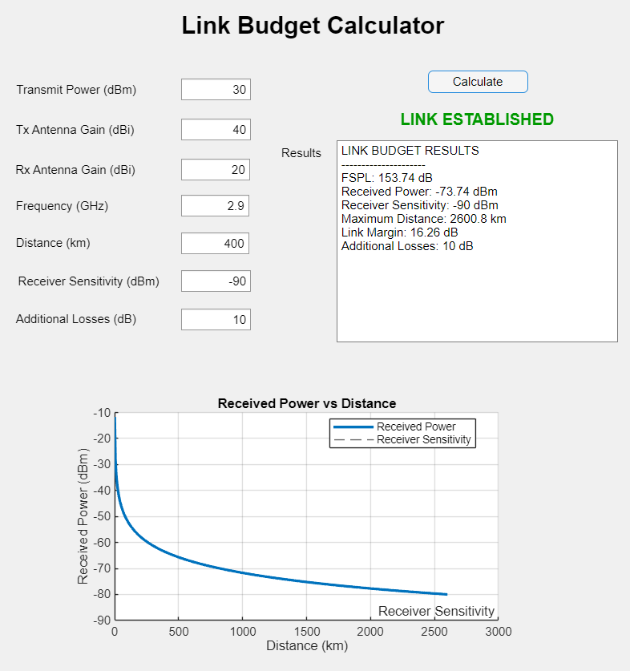

# Link-Budget-Calculator-MATLAB
MATLAB App Designer tool for RF and satellite communication link budget analysis.
# Link Budget Calculator (MATLAB)

MATLAB App Designer application for RF and satellite communication link analysis.

## Features

- Free Space Path Loss (FSPL) calculation
- Received Power estimation
- Receiver Sensitivity analysis
- Link Margin calculation
- Maximum Communication Distance estimation
- Power vs Distance visualization
- Additional Link Losses support
- Link Status Indicator

## Technologies

- MATLAB
- App Designer
- RF Communications
- Satellite Communications

## Example

Inputs:
- Tx Power: 30 dBm
- Tx Gain: 40 dBi
- Rx Gain: 20 dBi
- Frequency: 2.9 GHz
- Distance: 400 km
- Receiver Sensitivity: -90 dBm

Outputs:
- FSPL: 153.74 dB
- Received Power: -63.74 dBm
- Link Margin: 26.26 dB
- Maximum Distance: 8224.4 km

## Application Screenshot

